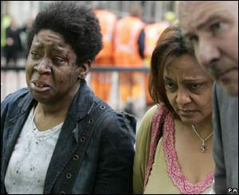

Aver visto su ogni canale televisivo i servizi che mostrano cos'è successo a Londra mi fa stare male. Per un istante sono fiero di ciò che dice Tony Blair: non permetteremo che abbia successo chi vuole distruggere i nostri valori e i nostri traguardi. Non erano le sue parole esatte, ma mi sembra suonassero più o meno così. Si susseguono tutte le solite riflessioni del momento. Per me una è particolarmente importante, ma forse nessun TG me la può dare. Sono nato in un'epoca di cambiamenti. Il mondo sta cambiando, in peggio. Più o meno da ogni parte si sta distruggendo ciò che qualcun altro ha costruito. Non ho il coraggio o l'insensatezza per dire che questa è l'epoca peggiore che l'umanità sta vivendo. Però il fatto che siano gli stessi uomini a rendersi la vita difficile a vicenda la dice lunga. Non so quali previsioni si possano fare. La mia speranza è che gli uomini ritrovino ciò che hanno perso.. la pace. Non si può costruire nulla in un mondo in guerra. 
