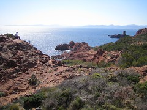

  

[Costa dorata](http://www.flickr.com/photos/ian-b-sparrow/129097060/)  
Originally uploaded by [ianbsparrow](http://www.flickr.com/people/ian-b-sparrow/).

Mi spiace non saper scrivere qualcosa di più di questa foto. Mi basta dire che ogni tanto è necessario staccare da questo mondo e scoprire quello che sta accanto. In cui la primavera è arrivata, le giornate passano veloci e poche cose creano ansia in me.  
Mi stupisco del mio italiano, e vado a dormire.
