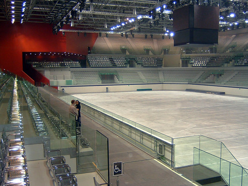

  

[Palavela di Torino](http://www.flickr.com/photos/rub1net/195358428/) Originally uploaded by [rub!net](http://www.flickr.com/people/rub1net/).

  
In questi giorni sta tornando di moda il pattinaggio su ghiaccio. Vuoi perchè Atrium ha aperto la pista all'aperto, vuoi perchè comincia a fare freddo.

L'anno scorso avevo pubblicato una serie di link utili per trovare tutti gli impianti di Torino (e un pezzettino di provincia) in cui pattinare. Quest'anno mi ripeto, aiutato anche dagli amici.

Il comune di Torino mette a disposizione di tutti un elenco degli impianti disponibili ai cittadini, e lo sportello informaGiovani fa anche di meglio: offre un motore di ricerca per impianti sportivi di ogni genere, a Torino e provincia. L'interfaccia della pagina non aiuta molto l'utente, e lo lascia in balia dei risultati. Comunque, con un po' di pazienza si arriva ai risultati più interessanti, che sono molto dettagliati.

Sono anche di aiuto i siti delle società sportive che hanno ricevuto in concessione dal comune gli impianti, soprattutto per chi ha intenzione di iniziare uno sport sul ghiaccio.

Mi spiace che alcuni comuni (come quello di Settimo) non abbiano più rinnovato il loro impegno nei confronti del pattinaggio su ghiaccio. Forse sono ancora in tempo per rimediare, ma al momento non danno segno di interesse.

**Impianti**

- [Atrium](http://www.atriumtorino.it/iniziative.php?ID=72)
- [Il sito del comune di Torino (poco aggiornato)](http://www.comune.torino.it/sport_torino/pattinaggiogh.htm)
- [Informagiovani (varie ricerche)](http://giovani.comune.torino.it/h3/h3.dll/a2000ig/fvis)
- [Cesana](http://giovani.comune.torino.it/h3/h3.dll/a2000ig/sC:!TEMP!HwTemp!3so44190.tmp/d60/fvis?pg=24)
- [Torino (Palaghiaccio)](http://giovani.comune.torino.it/h3/h3.dll/a2000ig/sC:!TEMP!HwTemp!3so44190.tmp/d64/fvis?pg=24)
- [Torino (Palazzetto del ghiaccio Massari)](http://giovani.comune.torino.it/h3/h3.dll/a2000ig/sC:!TEMP!HwTemp!3so44190.tmp/d66/fvis?pg=24)
- [Torino (Patinoire Le Gru)](http://giovani.comune.torino.it/h3/h3.dll/a2000ig/sC:!TEMP!HwTemp!3so44190.tmp/d69/fvis?pg=24)
- [Torre Pellice (stadio del ghiaccio)](http://giovani.comune.torino.it/h3/h3.dll/a2000ig/sC:!TEMP!HwTemp!3so44190.tmp/d111/fvis?pg=24)
- [Torino (PISTA DI PATTINAGGIO SU GHIACCIO GE ICE PLAZA)](http://giovani.comune.torino.it/h3/h3.dll/a2000ig/sC:!TEMP!HwTemp!3so44190.tmp/d107/fvis?pg=24)
    

**Articoli**

- [Inaugurazione del palaghiaccio Tazzoli](http://www.aicstorino.it/modules.php?name=News&file=article&sid=331)
- [Termine dei lavori dell'impianto di Corso Tazzoli](http://www.agenziatorino2006.it/opere/media/u06/index.htm)
