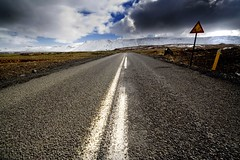

  

[end of the road](http://www.flickr.com/photos/rikki_/129162761/)  
Originally uploaded by [Rikki\_](http://www.flickr.com/people/rikki_/).

In questi giorni mi sento un po' come di fronte a questa foto. Non so dove porti la strada, cosa ci sia all'orizzonte, cosa vogliano dire le nuvole. C'è solo una lunga strada da percorrere.  
  
Non so se un tempo mi piacesse viaggiare. Il 20 Luglio 2004 per me è stato un giorno particolare: ho cominciato a viaggiare.  
  
Devo molto ad una colorata ed allegra città.. Non perchè mi abbia fatto capire dove andare (l'ho creduto per un po'), ma perchè mi ha fatto capire che dovevo partire.  
  
Adesso, dopo quasi due anni, rivivo le sensazioni che ho provato in quella città e in quel paese.  
  
In carrozza, Ivo. Si parte.
