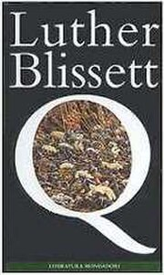

today I have had the chance to read an old post from Ambra. In its [post](http://www.grunig.eu/SensibleSensitivity/2006/11/24/cerco-amy/) (in italian), she writes about an author. Her name is Amy Hempel, and [one](http://www.pifmagazine.com/SID/413/) of its short novels is published on the net. I find this wondeful: a community of writers publishing some of their pieces on an accessible-by-everyone medium. ([http://www.pifmagazine.com/TID/)](http://www.pifmagazine.com/TID/)

About this new generation phenomenon, I can add a link towards the [wumingfoundation](http://www.wumingfoundation.com/), a group of italian writers who publish their works via a classic medium and through the internet. Their works are published by Einaudi (one of the most famous and respected editor in Italy). But a copy of their works is always available on their site. Miracles of copyleft. Now, you only have to search them (accessing the wuming site, see above for the link).

In facts, as I write, and as I read their site, I discover the [Luther Blissett Project](http://en.wikipedia.org/wiki/Luther_Blissett_%28footballer%29#Blissett_and_the_.22Luther_Blissett_Project.22). Named after a 80es footballer name, that's bizarre! :-)

And what about the discovery of the wuming group? That's more bizarre, yet. I was reading a french traduction of an interview they released to the Guardian.co.uk...

That's why I am amazed by the noise[.](http://ibellinsalarin.blogspot.com/)

