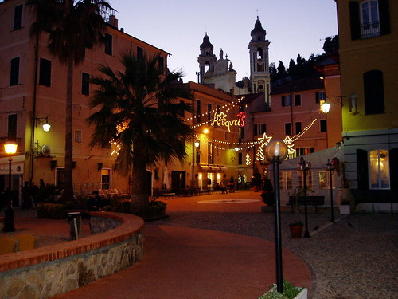

  

c'è una canzone che inizia proprio così. (dei crash-test-dummies)

la parola canzone mi fa venire in mente soprattutto ieri sera, Laigueglia, e un piccolo locale che si chiama "La trattoria dei Pignuin" e quello a fianco, "Il buco del..."

ieri sera vivevo in un'atmosfera meravigliosa. sembrava più un sogno che realtà. non immaginavo una simile fortuna, tutta in fila: Cat Stevens, Dire Straits, Eagles, Jim Morrison e tanti altri autori. non riuscivo ad immaginare una cena più buona e un accompagnamento migliore.

certo, è vero, è stata pure serata di figuracce. però anche loro servono ad aggiungere risate e allegria al conto.

è stato brutto, invece, il risveglio di stamattina. i postumi della bella serata (e mangiata), un brutto incubo appena passato, e tanta tanta arrabbiatura.

la sensazione di disagio è nata col risveglio dopo l'incubo: non volevo semplicemente tornare a casa. quale casa, poi?

forse è questa la verità: non ho più un luogo nel quale mi sento a casa. e così, la mia casa diventa tutti quei luoghi dove sto bene, dove passo dei bei momenti, dove è Lei.

è un momento strano, questo. tutto si muove sotto i miei piedi. un terremoto continuo, fatto di litigi, novità, paure.

così, come un qualsiasi uomo, aspetto che passi; e intanto prendo le mie decisioni.

Buonanotte.
